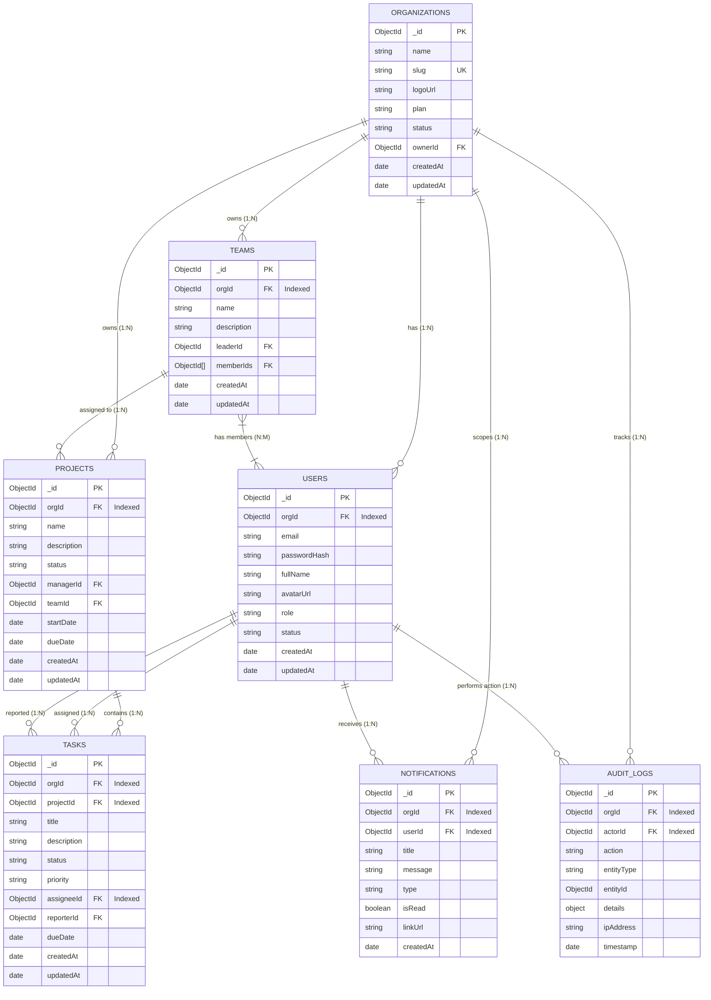

# Database ERD & Schema Design — Multi-Tenant Project Management System

## 1. Entity-Relationship Diagram (ERD)

The database design uses a shared MongoDB database with an explicit `orgId` reference across all entities to guarantee multi-tenant data isolation.



---

## 2. Comprehensive Collection Specifications & Schemas

### 2.1 Organizations Collection (`organizations`)
Stores tenant information and workspace settings.

```typescript
interface IOrganization {
  _id: Types.ObjectId;
  name: string;               // e.g. "Acme Corp"
  slug: string;               // e.g. "acme-corp" (URL safe, unique)
  logoUrl?: string;
  plan: 'FREE' | 'PRO' | 'ENTERPRISE';
  status: 'ACTIVE' | 'SUSPENDED';
  ownerId: Types.ObjectId;     // Reference to User (Org Admin)
  createdAt: Date;
  updatedAt: Date;
}
```
- **Indexes:** `{ slug: 1 }` (Unique), `{ ownerId: 1 }`

---

### 2.2 Users Collection (`users`)
Stores user accounts scoped to an organization.

```typescript
interface IUser {
  _id: Types.ObjectId;
  orgId: Types.ObjectId;       // Tenant Reference (Indexed)
  email: string;
  passwordHash: string;
  fullName: string;
  avatarUrl?: string;
  role: 'SuperAdmin' | 'OrgAdmin' | 'ProjectManager' | 'TeamMember';
  status: 'ACTIVE' | 'INVITED' | 'DEACTIVATED';
  inviteToken?: string;
  inviteExpiresAt?: Date;
  createdAt: Date;
  updatedAt: Date;
}
```
- **Indexes:** 
  - Compound Unique Index: `{ orgId: 1, email: 1 }` (Ensures unique email per organization).
  - Index: `{ inviteToken: 1 }`

---

### 2.3 Projects Collection (`projects`)
Stores project metadata within an organization.

```typescript
interface IProject {
  _id: Types.ObjectId;
  orgId: Types.ObjectId;       // Tenant Reference (Indexed)
  name: string;
  description?: string;
  status: 'PLANNING' | 'ACTIVE' | 'ON_HOLD' | 'COMPLETED' | 'ARCHIVED';
  managerId: Types.ObjectId;   // Reference to User (Project Manager)
  teamId?: Types.ObjectId;     // Reference to Team assigned to project
  startDate?: Date;
  dueDate?: Date;
  createdAt: Date;
  updatedAt: Date;
}
```
- **Indexes:** 
  - Compound Index: `{ orgId: 1, status: 1 }`
  - Compound Index: `{ orgId: 1, managerId: 1 }`

---

### 2.4 Tasks Collection (`tasks`)
Stores tasks created under a project.

```typescript
interface ITask {
  _id: Types.ObjectId;
  orgId: Types.ObjectId;       // Tenant Reference (Indexed)
  projectId: Types.ObjectId;   // Reference to Project (Indexed)
  title: string;
  description?: string;
  status: 'TO_DO' | 'IN_PROGRESS' | 'UNDER_REVIEW' | 'COMPLETED';
  priority: 'LOW' | 'MEDIUM' | 'HIGH' | 'URGENT';
  assigneeId?: Types.ObjectId; // Reference to User (Team Member)
  reporterId: Types.ObjectId;  // Reference to User (Creator)
  dueDate?: Date;
  createdAt: Date;
  updatedAt: Date;
}
```
- **Indexes:**
  - Compound Index: `{ orgId: 1, projectId: 1, status: 1 }`
  - Compound Index: `{ orgId: 1, assigneeId: 1, status: 1 }`

---

### 2.5 Teams Collection (`teams`)
Groups users for streamlined assignment to projects.

```typescript
interface ITeam {
  _id: Types.ObjectId;
  orgId: Types.ObjectId;       // Tenant Reference (Indexed)
  name: string;
  description?: string;
  leaderId: Types.ObjectId;    // Reference to User (Project Manager / Lead)
  memberIds: Types.ObjectId[]; // Array of User References
  createdAt: Date;
  updatedAt: Date;
}
```
- **Indexes:** `{ orgId: 1, name: 1 }`

---

### 2.6 Notifications Collection (`notifications`)
In-app notification system for users.

```typescript
interface INotification {
  _id: Types.ObjectId;
  orgId: Types.ObjectId;       // Tenant Reference (Indexed)
  userId: Types.ObjectId;      // Recipient User Reference (Indexed)
  title: string;
  message: string;
  type: 'TASK_ASSIGNED' | 'TASK_STATUS_CHANGED' | 'TEAM_ADDED' | 'USER_INVITED';
  isRead: boolean;
  linkUrl?: string;
  createdAt: Date;
}
```
- **Indexes:** `{ orgId: 1, userId: 1, isRead: 1, createdAt: -1 }`

---

### 2.7 Audit Logs Collection (`audit_logs`)
Immutable audit log for security & compliance.

```typescript
interface IAuditLog {
  _id: Types.ObjectId;
  orgId: Types.ObjectId;       // Tenant Reference (Indexed)
  actorId: Types.ObjectId;     // User who performed the action (Indexed)
  action: string;              // e.g. "PROJECT_CREATED", "USER_INVITED"
  entityType: 'Organization' | 'User' | 'Project' | 'Task' | 'Team';
  entityId: Types.ObjectId;
  details?: Record<string, any>; // JSON object of change diff
  ipAddress?: string;
  timestamp: Date;
}
```
- **Indexes:** `{ orgId: 1, timestamp: -1 }`, `{ orgId: 1, actorId: 1 }`

---

## 3. Database Integrity & Foreign Key Rules

1. **Cascade Logical Deletes:** When an Organization is deactivated/suspended, its users, projects, and tasks are logically deactivated by changing their `status` field — no hard delete is performed.
2. **Referential Check:** Before assigning a `userId` as `assigneeId` on a task, the application layer verifies that `user.orgId === task.orgId`.
3. **Compound Tenant Indexing:** Every single query issued to MongoDB starts with `orgId` as the leading index field, ensuring index scans never leak into another tenant's documents.
