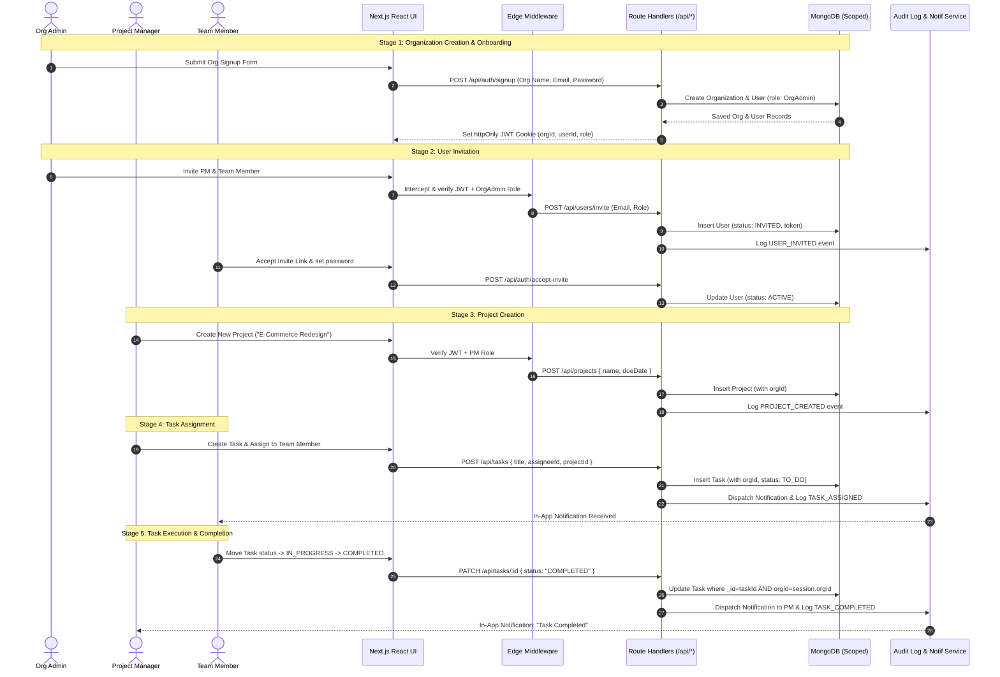
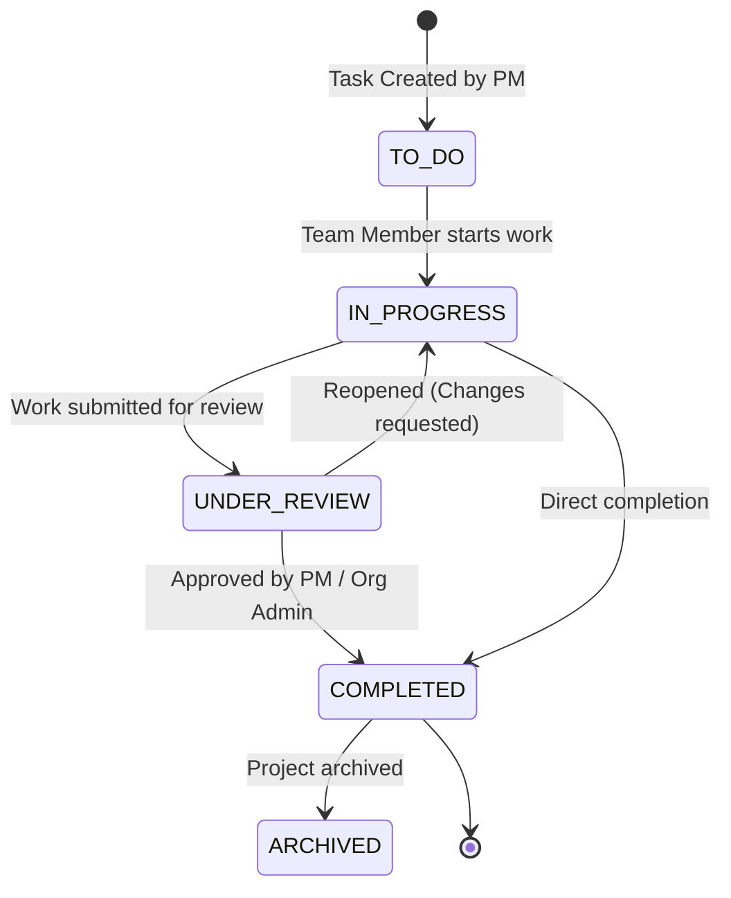

# System & User Workflows — Multi-Tenant Project Management System

## 1. Core System Lifecycle Overview

The standard operational cycle of the platform follows a structured 5-stage workflow:

```
[ Stage 1: Org Creation ] ──► [ Stage 2: User Invite ] ──► [ Stage 3: Project Creation ]
                                                                      │
[ Stage 5: Task Completion ] ◄── [ Stage 4: Task Assignment ] ◄───────┘
```

---

## 2. Step-by-Step Workflow Breakdown

### Stage 1: Organization Creation (Tenant Provisioning)
1. An incoming customer accesses `/signup` and completes the registration form (Name, Email, Password, Organization Name).
2. The backend creates a new `Organization` record with slug (e.g. `acme-corp`) and sets the creator's role as `OrgAdmin`.
3. A `User` record is created with `orgId = organization._id`.
4. A JWT session cookie containing `userId`, `orgId`, and `role = OrgAdmin` is issued.
5. An audit log entry (`ORG_CREATED`) is recorded.

### Stage 2: User Invitation & Team Onboarding
1. Org Admin navigates to `/users` and submits an invite form with `email` and `role` (`ProjectManager` or `TeamMember`).
2. The API generates a secure `inviteToken` and sets `status = INVITED` on a pending user record.
3. An email invitation with a link (`/accept-invite?token=xyz`) is dispatched to the user.
4. The invited user opens the link, sets their password and full name, and completes onboarding.
5. Account status transitions to `ACTIVE`, and a notification is dispatched to Org Admin.

### Stage 3: Project Creation & Team Formation
1. Project Manager logs in, navigates to `/projects`, and clicks "Create Project".
2. Fills out project details (Title, Description, Start Date, Due Date).
3. Optionally creates a `Team` (e.g., "Frontend Developers") and assigns team members to the project.
4. The project is created with `orgId = session.orgId` and `status = PLANNING` or `ACTIVE`.
5. Audit log entry (`PROJECT_CREATED`) is recorded.

### Stage 4: Task Creation & Assignment
1. Project Manager accesses the project Kanban board and clicks "Add Task".
2. Specifies task title, description, priority (`High`, `Medium`), due date, and selects a Team Member (`assigneeId`).
3. Task is saved with `orgId = session.orgId`, `projectId`, `status = TO_DO`.
4. An in-app `Notification` record is created for the assigned Team Member: `"You have been assigned to task: Fix Login Bug"`.

### Stage 5: Task Execution, Status Transition & Completion
1. Team Member logs in, sees the assigned task on their "My Tasks" dashboard.
2. Updates status from `TO_DO` to `IN_PROGRESS` as work begins.
3. Upon finishing work, updates status to `UNDER_REVIEW` or `COMPLETED`.
4. System updates task status in MongoDB, dispatches a status update notification to the Project Manager, and creates an audit log entry (`TASK_STATUS_UPDATED`).

---

## 3. End-to-End Sequence Diagram (Mermaid)



---

## 4. Task State Machine Transition Rules

Tasks strictly adhere to the following state transition flow:



### Transition Validation Rules:
- **`TO_DO` -> `IN_PROGRESS`:** Permitted by Assigned Team Member, PM, or Org Admin.
- **`IN_PROGRESS` -> `UNDER_REVIEW`:** Permitted by Assigned Team Member.
- **`UNDER_REVIEW` -> `COMPLETED`:** Permitted by PM or Org Admin.
- **`COMPLETED` -> `IN_PROGRESS`:** Permitted by PM or Org Admin (Reopening task).