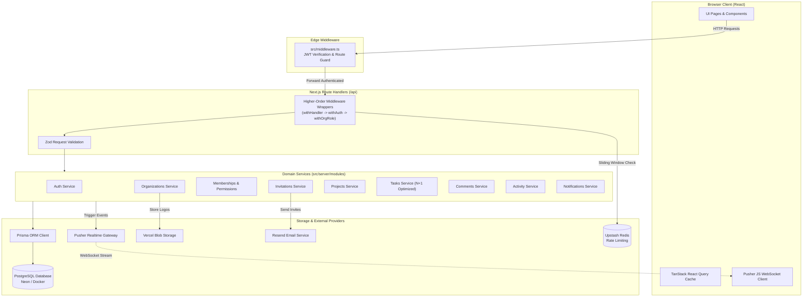
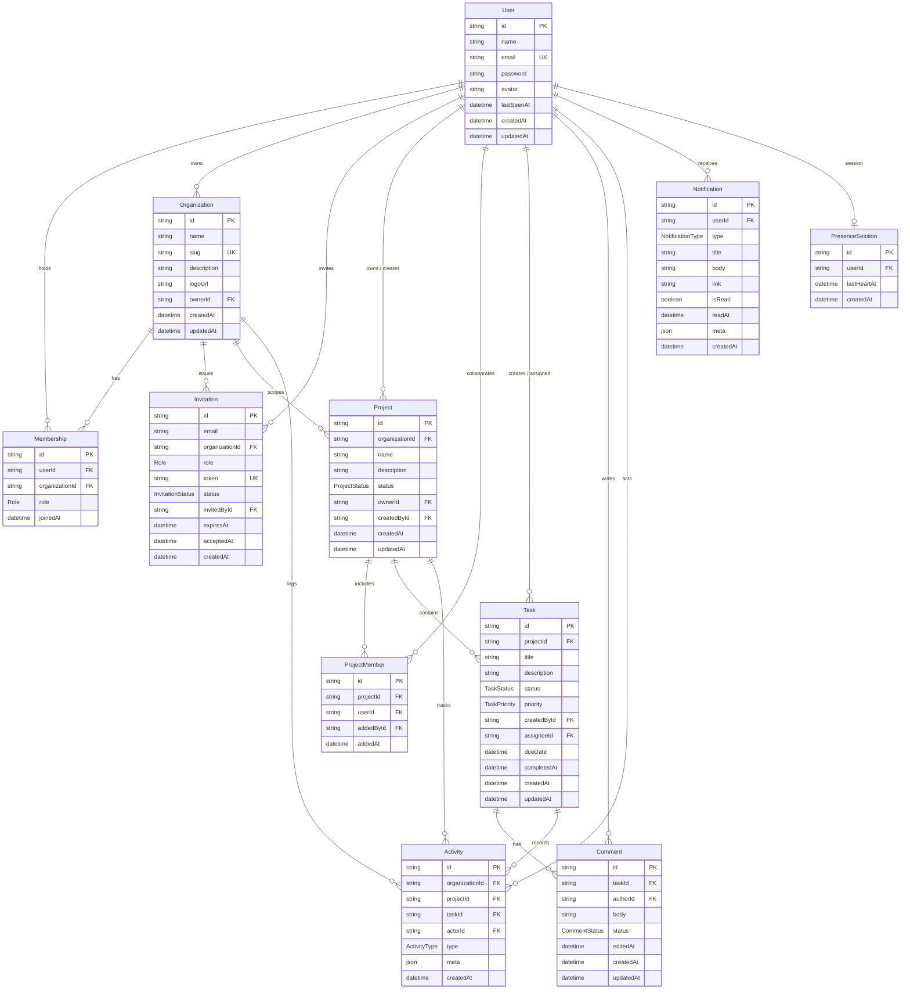

# Team Collaboration SaaS — Master Platform Documentation

A production-grade, secure, multi-tenant collaboration platform built as a single, cohesive Next.js 15+ (App Router) application. Designed to support modern product teams with organization workspaces, role-based access control (RBAC), end-to-end task workflows, rich discussions, real-time audit trails, live presence, and WebSocket event broadcasting.

---

## Table of Contents
1. [Overview](#1-overview)
2. [Features](#2-features)
3. [Tech Stack](#3-tech-stack)
4. [Architecture & System Flow](#4-architecture--system-flow)
5. [Data Model & Database Schema](#5-data-model--database-schema)
6. [Environment Variables](#6-environment-variables)
7. [Installation & Local Development](#7-installation--local-development)
8. [API Reference](#8-api-reference)
9. [Authentication Flow & Session Management](#9-authentication-flow--session-management)
10. [Authorization & Permissions Matrix](#10-authorization--permissions-matrix)
11. [Real-Time System (WebSockets & Presence)](#11-real-time-system-websockets--presence)
12. [Testing Guide & Quality Assurance](#12-testing-guide--quality-assurance)
13. [Performance & Query Optimization](#13-performance--query-optimization)
14. [Production Deployment Runbook](#14-production-deployment-runbook)
15. [Known Limitations & Future Roadmap](#15-known-limitations--future-roadmap)
16. [Seeded Test Accounts](#16-seeded-test-accounts)

---

## 1. Overview

The **Team Collaboration SaaS** is an enterprise-ready workspace platform engineered from the ground up to prevent multi-tenant data leaks and minimize query latency while providing an instantaneous, reactive user experience.

### Key Objectives Achieved:
- **Zero Cross-Tenant Leakage**: Strict IDOR boundary isolation guarantees that users can never access, mutate, or query organizations, projects, tasks, comments, or activity logs belonging to tenants they are not members of.
- **Deterministic Pure RBAC**: Every permission check executes through pure, testable authorization policies (`canPerformAction(membership, resource)`), preventing scattered or contradictory role logic.
- **Real-Time Push Architecture**: Powered by Pusher WebSockets, updates to task status, new comments, activity items, and in-app notifications are broadcast instantly to connected clients without client-side polling.
- **Production Hardened**: Fully guarded against N+1 query bottlenecks, unindexed lookups, CSRF forgery, and missing environment secrets in production.

---

## 2. Features

### Auth & Users
- **Secure Registration & Login**: Validated via strict Zod schemas with multi-factor password complexity (uppercase, lowercase, numbers, minimum length).
- **Password Security**: Salted and hashed using `bcryptjs` (cost factor 12).
- **Session Management**: Edge-compatible HS256 JWT tokens created using `jose`, stored in `httpOnly`, `SameSite=Lax`, `Secure` cookies with automatic `Authorization: Bearer` fallback for programmatic API clients.
- **User Profiles & Avatars**: Dynamic avatar generation based on user initials with optional custom avatar support.
- **Session Introspection**: Real-time `/api/auth/me` endpoint returns active user profile and joined organization list.

### Organizations & Memberships
- **Multi-Tenant Workspaces**: Users can create, switch between, and manage multiple completely isolated workspaces.
- **Dynamic Slug Generation**: Automatically converts workspace names into URL-friendly unique slugs with conflict resolution.
- **Logo Storage**: Integrated with `@vercel/blob` for production CDN uploads, featuring a graceful local data-URI preview fallback for local development.
- **Role Hierarchy**: Strict three-tier role system: `OWNER`, `ADMIN`, and `MEMBER`.
- **Safe Member Removal**: Enforces the **Last Owner Rule** (an organization can never remove its sole owner). Removing a member automatically cascades across all projects within that organization, stripping project access while preserving past task assignments with an inactive indicator.

### Invitations Lifecycle
- **Cryptographic Token Security**: Generates high-entropy 32-byte raw hex tokens; only the one-way **SHA-256 hash** is persisted in PostgreSQL to protect against database exposure.
- **Transactional Delivery**: Integrated with Resend for transactional email dispatch, with an automatic CLI fallback that prints clickable invitation links in local development.
- **72-Hour Expiry Window**: Automatic invalidation of expired invitation tokens (`410 Gone`).
- **Concurrent Safe Acceptance**: Interactive database transactions prevent race conditions or double-claim exploits. If an existing member clicks the invite, the system idempotently redirects them without throwing an error.

### Projects Management
- **Lifecycle Statuses**: Support for `PLANNING`, `ACTIVE`, `ON_HOLD`, `COMPLETED`, and `ARCHIVED`.
- **Project Lead Ownership**: Every project designates an owner/lead responsible for project delivery.
- **Project Member Assignment**: Only organization members can be added as project collaborators.
- **Tenant Scoping**: All project operations strictly validate the parent `organizationId` parameter against the project's foreign key.

### Tasks Management
- **Granular Triage Attributes**: Full control over `status` (`TODO`, `IN_PROGRESS`, `REVIEW`, `COMPLETED`) and `priority` (`LOW`, `MEDIUM`, `HIGH`, `URGENT`).
- **Assignment Validation**: Tasks can strictly only be assigned to users who are active members of that specific project.
- **Assignee Retention & Graceful Offboarding**: When a user leaves an organization or project, their past task assignments remain intact for auditability, flagged with `isAssigneeActive: false`.
- **Unified Multi-Filter & Search**: Full search across task titles and descriptions with instant filtering by status, priority, assignee, due date ranges, and overdue state.
- **Aggregated "My Tasks" Workspace View**: Cross-project dashboard consolidating all tasks assigned to the authenticated user across every accessible project.

### Comments & Discussions
- **Rich Task Discussions**: Real-time comment threads on task detail pages.
- **Strict Author Immutability**: Only the original comment author has permission to edit their comment (`403 Forbidden` even for Organization Admins).
- **Administrative Moderation**: Both the comment author and Organization/Project Admins can delete offensive comments.
- **Soft Deletion & Audit**: Comments support clean deletion states with audit log persistence.

### Audit Activity Logs
- **13 Granular Event Types**: Automatically logs `TASK_CREATED`, `TASK_UPDATED`, `TASK_DELETED`, `TASK_STATUS_CHANGED`, `TASK_ASSIGNED`, `TASK_COMMENT_ADDED`, `TASK_COMMENT_DELETED`, `PROJECT_CREATED`, `PROJECT_UPDATED`, `PROJECT_DELETED`, `MEMBER_ADDED`, `MEMBER_REMOVED`, and `MEMBER_ROLE_CHANGED`.
- **Metadata State Diffs**: Automatically captures transition diffs (e.g. `{ oldStatus: "IN_PROGRESS", newStatus: "COMPLETED" }`) for forensic tracking.
- **Cursor-Based Pagination**: Efficient, index-backed cursor pagination for fast Infinite Scroll feeds without deep offset database degradation.

### In-App Notifications
- **Targeted Notification Events**: Real-time in-app alerts triggered by `TASK_ASSIGNED`, `TASK_COMMENT`, `PROJECT_INVITATION`, `MEMBER_JOINED`, and `@MENTION`.
- **Direct Navigation Links**: Notifications include direct deep links to the target project, task, or workspace.
- **Batch Read & Clean Up**: Instant single-click "Mark All as Read" and individual deletion protected by user-ownership boundaries.

### Real-Time & Live Presence
- **Pusher WebSockets Integration**: Event-driven client synchronization for instant UI updates.
- **Private & Presence Channels**:
  - `private-user-{userId}`: Targeted in-app alerts and notifications.
  - `private-task-{taskId}`: Live task status updates and instant comment arrivals.
  - `presence-org-{orgId}`: Live workspace presence displaying which teammates are actively online.
- **Graceful Offline Fallback**: Real-time listeners fail silently and log cleanly if Pusher credentials are omitted or network disconnects occur.

---

## 3. Tech Stack

| Layer | Technology | Version / Package | Purpose |
|---|---|---|---|
| **Framework** | Next.js | `^15.0.0` (App Router) | React Server & Client components, Route Handlers, Edge Middleware |
| **Language** | TypeScript | `^5.0.0` (Strict Mode) | End-to-end type safety, strict schema contracts, zero `any` |
| **Styling** | Tailwind CSS + Lucide Icons | `^3.4.0` / `lucide-react` | Dark-mode design system, accessible UI primitives, icons |
| **Database** | PostgreSQL | `16.x` | ACID relational database with UUID keys & foreign key constraints |
| **ORM** | Prisma ORM | `^5.22.0` | Type-safe query builder, declarative migrations, schema management |
| **Authentication** | `bcryptjs` + `jose` | `^2.4.3` / `^5.9.6` | Pure-JS bcrypt hashing (cost 12) + edge-compatible HS256 JWTs |
| **Validation** | Zod | `^3.23.8` | Unified input validation schemas across client forms and server routes |
| **State & Caching**| TanStack Query (React Query) | `^5.62.0` | Client server-state caching, optimistic updates, query invalidation |
| **Form Management**| React Hook Form + `@hookform/resolvers` | `^7.54.0` | Performant uncontrolled forms with instant client validation |
| **Real-Time** | Pusher Channels | `pusher` / `pusher-js` | Server-triggered WebSocket broadcasting & presence channels |
| **Rate Limiting** | Upstash Redis | `@upstash/ratelimit` / `@upstash/redis` | Distributed sliding-window rate limiting with in-memory dev fallback |
| **Transactional Email** | Resend | `resend` `^4.0.0` | Invitation delivery with automatic CLI console logging fallback |
| **Asset Storage** | Vercel Blob | `@vercel/blob` `^0.26.0` | Cloud object storage for organization logos |
| **Logging** | Pino | `pino` `^9.5.0` | High-throughput structured JSON logging with credential redaction |
| **Testing** | Vitest | `^2.1.8` | High-speed integration & unit testing runner |

---

## 4. Architecture & System Flow

The platform is organized according to a strict **Layered Single-Project Architecture**:



### The Higher-Order Wrapper Execution Pipeline:
1. **`withHandler`**: Root error boundary catching `AppError`, `ZodError`, and Prisma errors; enforces CSRF Origin headers on mutating requests (`POST`, `PATCH`, `DELETE`); logs structured JSON via Pino.
2. **`withAuth`**: Extracts and validates the HS256 JWT from the `team_collab_token` cookie or `Authorization: Bearer` header; injects `ctx.user`.
3. **`withOrgRole(allowedRoles, handler)`**: Validates the `organizationId` UUID format, confirms organization existence, asserts user membership, confirms the user holds one of the required roles, and injects `ctx.organization` and `ctx.membership`.

---

## 5. Data Model & Database Schema

The database model is defined in `prisma/schema.prisma` with 11 relational entities and comprehensive foreign key cascade rules:



---

## 6. Environment Variables

All environment variables are validated at runtime using Zod in `src/server/config/env.ts`.

| Variable | Required in Prod? | Default / Dev Fallback | Description | Where to Obtain |
|---|:---:|---|---|---|
| `NODE_ENV` | **Yes** | `development` | Runtime environment mode (`development`, `production`, `test`) | System / Node.js |
| `DATABASE_URL` | **Yes** | `postgresql://...` | Connection pooled PostgreSQL URL | [Neon Dashboard](https://neon.tech) |
| `DIRECT_URL` | **Yes** | `postgresql://...` | Direct connection URL for migrations | [Neon Dashboard](https://neon.tech) |
| `JWT_SECRET` | **Yes** | Dev fallback (blocked in prod) | 256-bit cryptographically secure secret for HS256 tokens | Terminal: `openssl rand -base64 48` |
| `JWT_EXPIRES_IN` | No | `7d` | Lifetime of authentication JWT tokens | Application config |
| `NEXT_PUBLIC_APP_URL` | **Yes** | `http://localhost:3000` | Public domain of the web application | Vercel domain or custom domain |
| `NEXT_PUBLIC_API_URL` | **Yes** | `http://localhost:3000/api` | Public base URL of the API endpoints | Vercel domain or custom domain |
| `RESEND_API_KEY` | Optional | Logs to terminal in dev | Resend API key for transactional emails | [Resend Console](https://resend.com) |
| `EMAIL_FROM` | No | `onboarding@resend.dev` | Sender email address for invitations | Resend verified domain |
| `BLOB_READ_WRITE_TOKEN` | Optional | Local data-URI fallback | Vercel Blob read/write token for logo storage | [Vercel Storage](https://vercel.com/dashboard) |
| `INVITATION_EXPIRES_IN_HOURS`| No | `72` | Number of hours before an invitation expires | Application config |
| `UPSTASH_REDIS_REST_URL` | Optional | In-memory limiter fallback | Upstash Redis REST URL for rate limiting | [Upstash Console](https://console.upstash.com) |
| `UPSTASH_REDIS_REST_TOKEN` | Optional | In-memory limiter fallback | Upstash Redis REST Token | [Upstash Console](https://console.upstash.com) |
| `PUSHER_APP_ID` | **Yes (Prod)** | Dev stub if unset | Pusher Application ID | [Pusher Dashboard](https://pusher.com) |
| `PUSHER_KEY` | **Yes (Prod)** | Dev stub if unset | Pusher Public App Key | [Pusher Dashboard](https://pusher.com) |
| `NEXT_PUBLIC_PUSHER_KEY` | **Yes (Prod)** | Dev stub if unset | Pusher Public App Key exposed to the browser | [Pusher Dashboard](https://pusher.com) |
| `PUSHER_SECRET` | **Yes (Prod)** | Dev stub if unset | Pusher Private API Secret | [Pusher Dashboard](https://pusher.com) |
| `PUSHER_CLUSTER` | **Yes (Prod)** | `mt1` | Pusher App Cluster | [Pusher Dashboard](https://pusher.com) |
| `NEXT_PUBLIC_PUSHER_CLUSTER`| **Yes (Prod)** | `mt1` | Pusher App Cluster exposed to browser | [Pusher Dashboard](https://pusher.com) |

---

## 7. Installation & Local Development

### Prerequisites:
- **Node.js**: v20.x or v22.x LTS
- **Docker & Docker Compose** (for local PostgreSQL) or an active Neon PostgreSQL account
- **Git**

### Step-by-Step Setup:

1. **Clone the repository**:
   ```bash
   git clone <repository-url>
   cd week4/day5
   ```

2. **Install project dependencies**:
   ```bash
   npm install
   ```

3. **Configure environment variables**:
   ```bash
   cp .env.example .env
   ```
   *(The default `.env.example` is configured for instant local execution with Docker).*

4. **Start the local PostgreSQL container**:
   ```bash
   npm run db:up
   ```

5. **Run database migrations and seed default data**:
   ```bash
   npm run db:migrate
   npm run db:seed
   ```

6. **Start the local Next.js development server**:
   ```bash
   npm run dev
   ```

7. **Access the application**:
   Open [http://localhost:3000](http://localhost:3000) in your browser. Log in with any of the seeded accounts (e.g. `alice@example.com` / `Password123!`).

---

## 8. API Reference

All API responses strictly adhere to a consistent standard JSON envelope:

```json
// Success Response
{
  "success": true,
  "message": "Task updated successfully",
  "data": { ... }
}

// Error Response
{
  "success": false,
  "message": "You do not have permission to perform this action",
  "errors": [
    { "field": "role", "message": "Role must be ADMIN or MEMBER" }
  ]
}
```

### Complete Endpoints Table:

| Method | Path | Auth Required? | Required Role | Description |
|:---:|---|:---:|:---:|---|
| `GET` | `/api/health` | No | Public | Healthcheck verifying DB connection & uptime |
| `POST` | `/api/auth/register` | No | Public | Create new account & set JWT cookie |
| `POST` | `/api/auth/login` | No | Public | Authenticate user & set JWT cookie |
| `POST` | `/api/auth/logout` | Yes | Authenticated | Clear session cookie |
| `GET` | `/api/auth/me` | Yes | Authenticated | Retrieve current session profile and orgs |
| `GET` | `/api/organizations` | Yes | Authenticated | List all organizations user belongs to |
| `POST` | `/api/organizations` | Yes | Authenticated | Create a new organization (creator is OWNER) |
| `GET` | `/api/organizations/:orgId` | Yes | MEMBER | Retrieve organization details |
| `PATCH` | `/api/organizations/:orgId` | Yes | ADMIN / OWNER | Update organization name, description, or slug (OWNER-only) |
| `DELETE` | `/api/organizations/:orgId` | Yes | OWNER | Delete organization and cascade all data |
| `POST` | `/api/organizations/:orgId/logo` | Yes | ADMIN / OWNER | Upload organization logo |
| `GET` | `/api/organizations/:orgId/members` | Yes | MEMBER | List, search, and filter organization members |
| `DELETE` | `/api/organizations/:orgId/members/:membershipId`| Yes | ADMIN / OWNER | Remove member enforcing RBAC & Last Owner rule |
| `GET` | `/api/organizations/:orgId/invitations` | Yes | ADMIN / OWNER | List active invitations for organization |
| `POST` | `/api/organizations/:orgId/invitations` | Yes | ADMIN / OWNER | Issue new invitation |
| `DELETE` | `/api/organizations/:orgId/invitations/:inviteId`| Yes | ADMIN / OWNER | Revoke/cancel pending invitation |
| `POST` | `/api/organizations/:orgId/invitations/:inviteId/resend`| Yes | ADMIN / OWNER | Regenerate token & extend expiry by 72h |
| `GET` | `/api/invitations/:token` | No | Public | Public token validation & preview |
| `POST` | `/api/invitations/:token/accept` | Yes | Authenticated | Accept invitation and join organization |
| `GET` | `/api/organizations/:orgId/projects` | Yes | MEMBER | List accessible projects |
| `POST` | `/api/organizations/:orgId/projects` | Yes | ADMIN / OWNER | Create new project |
| `GET` | `/api/organizations/:orgId/projects/:projectId` | Yes | MEMBER | Get project details and metrics |
| `PATCH` | `/api/organizations/:orgId/projects/:projectId` | Yes | Lead / ADMIN / OWNER | Update project details or status |
| `DELETE` | `/api/organizations/:orgId/projects/:projectId` | Yes | ADMIN / OWNER | Delete project and cascade tasks |
| `GET` | `/api/organizations/:orgId/projects/:projectId/members` | Yes | MEMBER | List project collaborators |
| `POST` | `/api/organizations/:orgId/projects/:projectId/members` | Yes | Lead / ADMIN / OWNER | Add organization member to project |
| `DELETE`| `/api/organizations/:orgId/projects/:projectId/members/:userId`| Yes | Lead / ADMIN / OWNER | Remove collaborator from project |
| `GET` | `/api/organizations/:orgId/projects/:projectId/dashboard` | Yes | MEMBER | Get real-time project KPIs & workload |
| `GET` | `/api/organizations/:orgId/projects/:projectId/tasks` | Yes | MEMBER | Multi-filter tasks for project |
| `POST` | `/api/organizations/:orgId/projects/:projectId/tasks` | Yes | MEMBER | Create task (assignee must be project member) |
| `GET` | `/api/organizations/:orgId/projects/:projectId/tasks/:taskId` | Yes | MEMBER | Get single task detail |
| `PATCH` | `/api/organizations/:orgId/projects/:projectId/tasks/:taskId` | Yes | MEMBER | Update task status, priority, or details |
| `DELETE`| `/api/organizations/:orgId/projects/:projectId/tasks/:taskId` | Yes | Creator / Lead / ADMIN | Delete task |
| `GET` | `/api/organizations/:orgId/tasks` | Yes | MEMBER | Cross-project "My Tasks" aggregated view |
| `GET` | `/api/organizations/:orgId/projects/:projectId/tasks/:taskId/comments` | Yes | MEMBER | List comments for task |
| `POST` | `/api/organizations/:orgId/projects/:projectId/tasks/:taskId/comments` | Yes | MEMBER | Add comment to task |
| `PATCH` | `/api/organizations/:orgId/projects/:projectId/tasks/:taskId/comments/:commentId`| Yes | Comment Author | Edit comment body (author only) |
| `DELETE`| `/api/organizations/:orgId/projects/:projectId/tasks/:taskId/comments/:commentId`| Yes | Author / ADMIN / OWNER | Delete comment |
| `GET` | `/api/organizations/:orgId/activity` | Yes | MEMBER | Cursor-paginated audit activity log |
| `GET` | `/api/notifications` | Yes | Authenticated | List user notifications |
| `PATCH` | `/api/notifications/:notificationId` | Yes | Notification Owner | Mark single notification as read |
| `DELETE`| `/api/notifications/:notificationId` | Yes | Notification Owner | Delete notification |
| `POST` | `/api/notifications/read-all` | Yes | Authenticated | Mark all user notifications as read |
| `POST` | `/api/pusher/auth` | Yes | Authenticated | Authenticate Pusher private & presence channels |

---

## 9. Authentication Flow & Session Management

```mermaid
sequenceDiagram
    autonumber
    actor User as Client Browser
    participant API as /api/auth/login
    participant DB as PostgreSQL
    participant App as Next.js Protected Routes

    User->>API: POST /api/auth/login { email, password }
    API->>DB: Query User by Email
    DB-->>API: Return User Record
    API->>API: Verify bcryptjs hash (Cost 12)
    API->>API: Sign HS256 JWT via jose (7 days)
    API-->>User: Set-Cookie: team_collab_token=<JWT>; HttpOnly; Secure; SameSite=Lax
    
    User->>App: Navigate to /dashboard/acme-corp
    App->>App: middleware.ts checks cookie presence & verifies JWT
    App-->>User: Render Dashboard Shell
```

### JWT Mechanics & Edge Compatibility:
- **Token Format**: Standard RFC 7519 JSON Web Token signed with HS256.
- **Library**: `jose` is utilized across both Edge middleware (`src/middleware.ts`) and Node.js route handlers (`src/server/lib/jwt.ts`), ensuring 100% Edge compatibility without heavy Node crypto dependencies.
- **Storage Strategy**: Stored inside an `httpOnly`, `Secure` (in production), `SameSite=Lax` cookie named `team_collab_token`.
- **API Client Support**: Route handlers automatically check the `Authorization: Bearer <token>` header if no cookie is present, enabling effortless mobile or automated testing integration.
- **CSRF Defense**: Mutating endpoints verify the incoming `Origin` and `Host` headers inside `withHandler`.

---

## 10. Authorization & Permissions Matrix

All authorization decisions evaluate through pure, deterministic functions in `src/server/modules/memberships/permissions.ts`.

| Resource & Action | Org OWNER | Org ADMIN | Org MEMBER | Non-Member / Outsider |
|---|:---:|:---:|:---:|:---:|
| **View Organization & Members** | ✅ | ✅ | ✅ | ❌ `403 Forbidden` |
| **Edit Org Name / Description** | ✅ | ✅ | ❌ `403 Forbidden` | ❌ `403 Forbidden` |
| **Edit Org Slug** | ✅ | ❌ `403 Forbidden` | ❌ `403 Forbidden` | ❌ `403 Forbidden` |
| **Delete Organization** | ✅ | ❌ `403 Forbidden` | ❌ `403 Forbidden` | ❌ `403 Forbidden` |
| **Invite `MEMBER`** | ✅ | ✅ | ❌ `403 Forbidden` | ❌ `403 Forbidden` |
| **Invite `ADMIN`** | ✅ | ❌ `403 Forbidden` | ❌ `403 Forbidden` | ❌ `403 Forbidden` |
| **Invite `OWNER`** | ❌ (Transfer Only) | ❌ `403 Forbidden` | ❌ `403 Forbidden` | ❌ `403 Forbidden` |
| **Remove `MEMBER`** | ✅ | ✅ | ❌ `403 Forbidden` | ❌ `403 Forbidden` |
| **Remove `ADMIN`** | ✅ | ❌ `403 Forbidden` | ❌ `403 Forbidden` | ❌ `403 Forbidden` |
| **Remove Sole `OWNER`** | ❌ `409 Conflict` | ❌ `403 Forbidden` | ❌ `403 Forbidden` | ❌ `403 Forbidden` |
| **Create Project** | ✅ | ✅ | ❌ `403 Forbidden` | ❌ `403 Forbidden` |
| **Edit Project Details** | ✅ | ✅ | ✅ (If Project Lead) | ❌ `403 Forbidden` |
| **Delete Project** | ✅ | ✅ | ❌ `403 Forbidden` | ❌ `403 Forbidden` |
| **Add / Remove Project Collaborator**| ✅ | ✅ | ✅ (If Project Lead) | ❌ `403 Forbidden` |
| **Create Task** | ✅ | ✅ | ✅ (If Project Member) | ❌ `403 Forbidden` |
| **Update Task / Triage Status** | ✅ | ✅ | ✅ (If Project Member) | ❌ `403 Forbidden` |
| **Delete Task** | ✅ | ✅ | ✅ (If Task Creator / Lead)| ❌ `403 Forbidden` |
| **Create Comment** | ✅ | ✅ | ✅ (If Project Member) | ❌ `403 Forbidden` |
| **Edit Comment** | ❌ (Author Only) | ❌ (Author Only) | ✅ (Author Only) | ❌ `403 Forbidden` |
| **Delete Comment** | ✅ | ✅ | ✅ (If Author) | ❌ `403 Forbidden` |
| **Mark / Delete Notification** | ❌ (Owner Only) | ❌ (Owner Only) | ✅ (Owner Only) | ❌ `403 / 404` |

---

## 11. Real-Time System (WebSockets & Presence)

The real-time layer is built using Pusher Channels with private and presence channels.

### Channel Hierarchy:
1. **`presence-org-{orgId}`**:
   - Subscribed to by all active members of an organization workspace.
   - Requires authorization via `/api/pusher/auth`.
   - Returns user info (`id`, `name`, `email`, `avatar`) to display live presence indicators.
2. **`private-task-{taskId}`**:
   - Subscribed to when viewing a specific task detail modal or page.
   - Broadcasts real-time events:
     - `comment:added`: When any collaborator submits a comment.
     - `comment:deleted`: When a comment is removed.
     - `task:updated`: When status, priority, or assignee is modified.
3. **`private-user-{userId}`**:
   - Subscribed to by the logged-in user globally across the application.
   - Broadcasts real-time events:
     - `notification:new`: Dispatched immediately when a task is assigned, user is mentioned, or comment is added.

### Pusher Auth Security:
The `/api/pusher/auth` route validates that the requesting user's session is authentic and asserts that:
- For `presence-org-{orgId}`, the user possesses an active `Membership` in that organization.
- For `private-user-{userId}`, the channel matches the authenticated user's ID.
- For `private-task-{taskId}`, the user belongs to the organization that owns the task's parent project.

---

## 12. Testing Guide & Quality Assurance

The test suite is built on **Vitest** and exercises the application through direct integration tests targeting Next.js route handlers.

### Mock Prisma Strategy:
Tests run with high velocity using an in-memory mock Prisma client (`tests/helpers/mock-prisma.ts`) that precisely replicates PostgreSQL relational logic, including:
- UUID generation and automatic timestamp management.
- Many-to-many join filtering (`where.assigneeId.in`).
- Sorting, limits, and cursor skips.
- Cascading record deletions on projects and memberships.

### Test Directory Overview (18 Test Suites, 142+ Tests):

| Test Suite | File Path | Focus Area |
|---|---|---|
| **E2E 15-Step Journey** | `tests/day5-e2e-workflow.test.ts` | Complete lifecycle: Registration -> Org -> Invite -> Project -> Member -> Task -> Reassign -> Comment -> Activity -> Notification -> Cleanup |
| **Security Sweep** | `tests/day5-security-sweep.test.ts` | RBAC matrix, malformed JWTs, expired invites, cross-tenant IDOR, and injection sanitization |
| **Authentication** | `tests/auth.test.ts` | Register, login, password complexity, token issuance, session verification |
| **Organizations** | `tests/organizations.test.ts` | Org creation, slug generation, duplicate slug rejection, creator ownership |
| **Memberships** | `tests/memberships.test.ts` | Member listing, role filtering, safe removal, last-owner safeguard |
| **Permissions** | `tests/permissions.test.ts` | Unit tests for pure permission predicates |
| **Invitations** | `tests/invitations.test.ts` | SHA-256 token hashing, email dispatch, expiry, transactional acceptance |
| **Projects** | `tests/projects.test.ts` | Project CRUD, status roadmap, lead assignment, access boundaries |
| **Project Members** | `tests/project-members.test.ts` | Adding/removing collaborators, non-org member rejection |
| **Tasks CRUD** | `tests/tasks.test.ts` | Task creation, assignment rules, status transitions, deletion permissions |
| **Task Search & Filter**| `tests/tasks-filter-search.test.ts`| Multi-field search, priority, status, overdue filtering, date ranges |
| **Cross-Tenant IDOR** | `tests/tenant-isolation-day3.test.ts`| Accessing Org A projects or tasks under Org B returns 404 |
| **Project Dashboard** | `tests/dashboard.test.ts` | KPI calculation, completion percentage, workload aggregation |
| **Comments & Audit** | `tests/day4-features.test.ts` | Task comments, activity logs, in-app notifications, Pusher auth |
| **Settings & Logo** | `tests/settings.test.ts` | Org name/slug updates, logo upload validation |
| **Rate Limiting** | `tests/rate-limit.test.ts` | Sliding window rate limiter enforcement and fallback |
| **Security Headers** | `tests/security.test.ts` | Cross-tenant isolation and CSRF origin protection |
| **Day 3 RBAC** | `tests/day3-permissions.test.ts` | Project and task permission permutations |

### Running the Tests:

```bash
# Run all tests sequentially
npm test

# Run a specific test suite
npx vitest run tests/day5-e2e-workflow.test.ts

# Run with watch mode during development
npx vitest
```

---

## 13. Performance & Query Optimization

During the Day 5 audit, potential N+1 bottlenecks were diagnosed and resolved:

### 1. `getMyTasks` Batching Optimization
- **Problem**: `getMyTasks` looped over each task and executed two separate `prisma.projectMember.findUnique` and `prisma.project.findUnique` queries per task to determine `isAssigneeActive` and `isOwner`. For 50 tasks, this generated 101 database queries.
- **Solution**: Refactored to fetch all distinct project IDs from the tasks list in a single batch, and performed two batched queries (`findMany` with `where: { projectId: { in: projectIds } }`). Total queries reduced from **O(2N + 1) to O(3)**.

### 2. `getProjectDashboard` Aggregation Optimization
- **Problem**: Member workload calculation iterated over all project members and ran an individual `prisma.task.count` query per member.
- **Solution**: Replaced the loop with a single `prisma.task.groupBy` query grouped by `assigneeId`, mapping counts in-memory. Database queries reduced from **O(N + 1) to O(2)**.

### 3. Cursor-Based Pagination for Activity & Notifications
- Large audit logs and notification feeds avoid `OFFSET` degradation by utilizing indexed cursor pagination (`take: limit + 1`, `cursor: { id: cursorId }`, `skip: 1`).

---

## 14. Production Deployment Runbook

Deploying the Team Collaboration SaaS to **Vercel** + **Neon PostgreSQL** + **Upstash Redis** + **Pusher**:

### Phase 1: Database Setup (Neon)
1. Log in to [Neon](https://neon.tech) and create a new project (e.g. `team-collab-prod`).
2. Copy the **Pooled connection string** (use this for `DATABASE_URL`).
3. Copy the **Direct connection string** (use this for `DIRECT_URL`).

### Phase 2: Real-Time Setup (Pusher)
1. Log in to [Pusher](https://pusher.com) and create a **Channels** app.
2. Note your `app_id`, `key`, `secret`, and `cluster` (e.g. `mt1`).

### Phase 3: Rate Limiting Setup (Upstash)
1. Log in to [Upstash](https://console.upstash.com) and create a Redis database.
2. Copy the `UPSTASH_REDIS_REST_URL` and `UPSTASH_REDIS_REST_TOKEN`.

### Phase 4: Configure Vercel Project
1. Import the repository into [Vercel](https://vercel.com).
2. Configure the following **Environment Variables** in the Vercel Dashboard:
   - `NODE_ENV`: `production`
   - `DATABASE_URL`: *Neon pooled connection string*
   - `DIRECT_URL`: *Neon direct connection string*
   - `JWT_SECRET`: *Generate using `openssl rand -base64 48`*
   - `NEXT_PUBLIC_APP_URL`: `https://your-app.vercel.app`
   - `NEXT_PUBLIC_API_URL`: `https://your-app.vercel.app/api`
   - `PUSHER_APP_ID`: *Pusher App ID*
   - `PUSHER_KEY`: *Pusher Public Key*
   - `NEXT_PUBLIC_PUSHER_KEY`: *Pusher Public Key*
   - `PUSHER_SECRET`: *Pusher Secret*
   - `PUSHER_CLUSTER`: *Pusher Cluster*
   - `NEXT_PUBLIC_PUSHER_CLUSTER`: *Pusher Cluster*
   - `UPSTASH_REDIS_REST_URL`: *Upstash REST URL*
   - `UPSTASH_REDIS_REST_TOKEN`: *Upstash REST Token*
   - `RESEND_API_KEY`: *Resend API key* (Optional)
   - `BLOB_READ_WRITE_TOKEN`: *Vercel Blob token* (Optional)

### Phase 5: Deploy & Apply Migrations
1. Deploy the project to Vercel.
2. Run database migrations against the production database:
   ```bash
   npx prisma migrate deploy
   ```
3. Optionally seed production test accounts:
   ```bash
   npm run db:seed
   ```
4. Verify deployment health by navigating to `https://your-app.vercel.app/api/health`.

---

## 15. Known Limitations & Future Roadmap

- **Organization Ownership Transfer**: Direct assignment of the `OWNER` role during invitation is intentionally disallowed to safeguard against accidental lockout. A formal multi-step ownership transfer flow is planned.
- **Rich Text WYSIWYG Editor**: Task descriptions and comments currently support standard markdown formatting. Future iterations will incorporate TipTap for collaborative rich-text editing.
- **Comment File Attachments**: Comments currently support textual communication. File attachment uploads via Vercel Blob on comments are slated for future release.
- **Full-Text Search Engine**: Current task and member search leverages PostgreSQL `ILIKE` queries with index backing. Transition to PostgreSQL `tsvector` full-text search or Algolia is planned for scale beyond 100,000 tasks per tenant.

---

## 16. Seeded Test Accounts

The seed script (`prisma/seed.ts`) populates the database with three realistic test users, two organizations, and a pre-configured invitation:

### Default Password (All Users):
```
Password123!
```

### User Accounts & Organization Roles:

| User | Email | Acme Corp Role | Startup Labs Role |
|---|---|:---:|:---:|
| **Alice Johnson** | `alice@example.com` | **OWNER** | **MEMBER** |
| **Bob Smith** | `bob@example.com` | **ADMIN** | **OWNER** |
| **Carol Williams** | `carol@example.com` | **MEMBER** | *(None)* |

### Seeded Invitation:
- **Invitation Link**: `http://localhost:3000/invitations/seed-test-invitation-token-12345`
- **Target Organization**: Acme Corp
- **Invited Email**: `david@example.com`
- **Assigned Role**: `MEMBER`
- **Raw Token**: `seed-test-invitation-token-12345` (stored in DB as SHA-256 hash)
